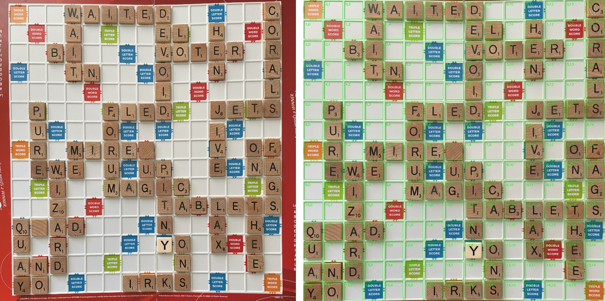

# Scrabble Vision

Offline Scrabble board scanner. Takes a photo of a board and outputs a 15×15 letter grid.

CV pipeline with a CNN (~200K params) — no external API calls. Runs on CPU in <500ms per board.

## How It Works

1. **Grid Detection** — Auto-detect or interactively select the 4 board corners
2. **Cell Classification** — CNN classifies all 225 cells (A-Z + BONUS + EMPTY, 28 classes)
3. **Output** — 15×15 letter grid with confidence scores. BONUS and EMPTY map to `.`

## Eval Result

Evaluated on a held-out board image separated from all training data:



```
Cell accuracy:   223/225 (99.1%)
Letter accuracy:  92/94  (97.9%)
Empty accuracy:  131/131 (100.0%)
Total errors: 2
```

## Quick Start

```bash
uv sync

# Scan a board (interactive corner selection with grid overlay)
uv run scan.py --image path/to/board.jpg --interactive --debug

# Web scanner (open on phone, same WiFi)
uv run uvicorn server:app --host 0.0.0.0 --port 8001
```

## Training

The model ships pre-trained. To retrain from scratch:

```bash
# Full pipeline: extract real tiles, augment, generate synthetic, train, evaluate
retrain.bat
```

Training uses two sources combined:

- **Synthetic tiles** — rendered letters on tile-colored backgrounds with augmentation (rotation, noise, shadows, blur). Generated by `generate_tiles.py`.
- **Real tiles** — extracted from photographed boards in `data/raw_boards/` using saved corners and ground truth labels. Augmented by `augment_tiles.py` to balance rare letters and increase data coverage.

The eval board (`data/eval/`) is completely separated from the training pipeline — it is never used by `extract_tiles.py`, `augment_tiles.py`, or `train.py`.

## Project Structure

```
scrabble-vision/
├── src/
│   ├── detection/
│   │   └── grid_detect.py      # Corner detection, perspective warp, grid overlay
│   └── classification/
│       └── model.py             # TileClassifier CNN (28 classes), predict, ONNX export
├── web/
│   └── index.html               # Mobile web UI (camera, corner drag, editable board)
├── data/
│   ├── raw_boards/              # Training board photos + corners + ground truth
│   ├── eval/                    # Held-out eval board (not used in training)
│   ├── train/                   # Generated synthetic tiles (gitignored)
│   └── real_tiles/              # Extracted real tiles (gitignored)
├── models/
│   └── tile_classifier.pt       # Trained model weights
├── server.py                    # FastAPI backend for web scanner
├── scan.py                      # Full pipeline: image → 15×15 board
├── evaluate.py                  # Eval against ground truth (uses data/eval/)
├── extract_tiles.py             # Extract real tiles from training boards
├── augment_tiles.py             # Augment real tiles to balance classes
├── generate_tiles.py            # Generate synthetic training tiles
├── train.py                     # Train classifier (synthetic + real data)
└── retrain.bat                  # Run full training pipeline
```

## References

- [Scrabblers](https://github.com/LordVaTe/Scrabblers) — Scrabble board digitization using CNN classification
- [scrabble-solver](https://github.com/kwwangkw/scrabble-solver) — Board scanning with corner keypoint warping

These projects informed the pipeline design. This implementation differs in using synthetic + real tile training data, combined EMPTY/BONUS classification (no separate tile detection stage), and a mobile-first web interface.
