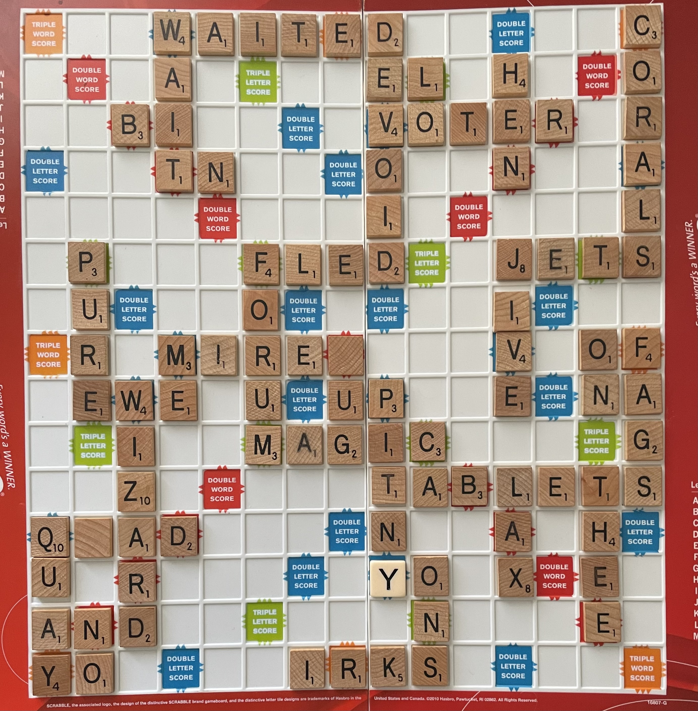

# Scrabble Vision

Offline Scrabble board scanner. Takes a photo of a board and outputs a 15×15 letter grid.

CV pipeline with a lightweight CNN (~200K params) — no external API calls. Runs on CPU in <500ms per board.

## How It Works

1. **Grid Detection** — Auto-detect or manually select the 4 board corners, perspective-warp to a square
2. **Cell Classification** — CNN classifies all 225 cells in one pass (A-Z + BONUS + EMPTY, 28 classes)
3. **Output** — 15×15 letter grid with confidence scores. BONUS and EMPTY map to `.`

## Eval Result

Evaluated on a held-out board image not used in training:



```
Cell accuracy: 215/225 (95.6%)
Letter accuracy: 88/93 (94.6%)
Empty accuracy: 127/132 (96.2%)
```

## Setup

```bash
# Install dependencies
uv sync

# Full training pipeline (extract tiles, augment, generate synthetic, train, evaluate)
retrain.bat

# Scan a board interactively
uv run scan.py --image path/to/board.jpg --interactive --debug

# Web scanner (open on phone, same WiFi)
uv run uvicorn server:app --host 0.0.0.0 --port 8000
```

## Project Structure

```
scrabble-vision/
├── src/
│   ├── detection/
│   │   └── grid_detect.py      # Corner detection, perspective warp, grid overlay
│   └── classification/
│       └── model.py             # TileClassifier CNN (28 classes), predict, ONNX export
├── web/
│   └── index.html               # Mobile web UI (camera, corner drag, editable board)
├── data/
│   ├── raw_boards/              # Training board photos + corners + ground truth
│   ├── eval/                    # Held-out eval board (not used in training)
│   ├── train/                   # Generated synthetic tiles (gitignored)
│   └── real_tiles/              # Extracted real tiles (gitignored)
├── models/
│   └── tile_classifier.pt       # Trained model weights
├── server.py                    # FastAPI backend for web scanner
├── scan.py                      # Full pipeline: image → 15×15 board
├── evaluate.py                  # Eval against ground truth (uses data/eval/)
├── extract_tiles.py             # Extract real tiles from training boards
├── augment_tiles.py             # Augment real tiles to balance classes
├── generate_tiles.py            # Generate synthetic training tiles
├── train.py                     # Train classifier (synthetic + real data)
└── retrain.bat                  # Run full training pipeline
```

## Training Data

Training uses two sources combined:

- **Synthetic tiles** — rendered letters on tile-colored backgrounds with augmentation (rotation, noise, shadows, blur). Generated by `generate_tiles.py`.
- **Real tiles** — extracted from photographed boards in `data/raw_boards/` using saved corners and ground truth labels. Augmented by `augment_tiles.py` to balance rare letters.

The eval board (`data/eval/`) is completely separated from the training pipeline.

## Acknowledgements

Built with the assistance of [Claude](https://claude.ai) (Anthropic).
